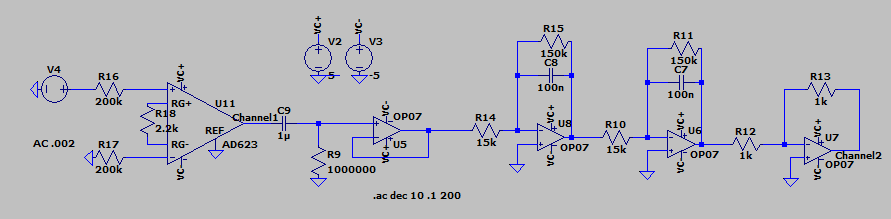

# ECGCircuitDesign
An educational ECG circuit that amplifies and filters mV level heart signals for viewing on an oscilloscope.

## Overview
The design uses a differential front end, active high pass and low pass filtering, and a final gain stage to deliver a clean QRS complex.

## Safety
- Power from batteries only
- Keep total input bias current and leakage very low
- Use fresh electrode pads
- This project is for lab demonstration, not for diagnosis or treatment

## Specs
- Input signal: ~0.5 mV to 2 mV differential from chest electrodes
- Total gain: 100, adjustable
- Pass band: 0.5 Hz to 40 Hz
- Optional notch 60 Hz
- Output range: 0.5 V to 2.5 V centered near mid supply for ADC use

## Hardware notes
- Op amp: ADA623 or similar low noise rail-to-rail op amp
- Supply: 6 x AA 
- Reference: virtual mid rail at Vref = Vcc / 2
- Electrodes: RA, LA to inputs, RL as bias or driven reference

## Design equations
Non-inverting high-pass cutoff  
\( f_{HPF} = \frac{1}{2\pi R_{HPF} C_{HPF}} \)  target 0.3 to 0.7 Hz

Inverting Low pass cutoff  
\( f_{LPF} = \frac{1}{2\pi R_{LPF} C_{LPF}} \)  target 35 to 45 Hz

Non inverting gain stage
\( A_v = 1 + \frac{R_f}{R_g} \)

## Bill of materials (short)
- ADA623 op amp
- Resistors: 1 percent, values per schematic
- Capacitors for filters
- 3 disposable ECG electrodes and snap leads
- Battery holder, 6 x AA 
- Prototype board or small PCB

## Build
1. Place the front end and the virtual ground first, then filters, then the final gain stage
2. Use a single capacitor near the op amp voltage inputs, decouple Vcc with 0.1 µF close to the pins

## Test procedure

1. **Power check**  
   - With no electrodes attached, verify Vcc and Vref are stable  
   - Scope Vref, it should be flat

2. **Signal test**  
   - Inject a 1 mVpp, 10 Hz sine through a large series resistor, for example 1 MΩ  
   - Verify gain and filter band are correct

3. **Electrode test**  
   - Attach RA and LA to the wrists or upper chest, RL to the leg  
   - Timebase 200 ms per division, vertical 0.5 V per division at the output  
## Demo

[ Watch the demo video](WorkingECG.mov)

<!-- Inline player. Works best in Safari for MOV files -->
<video src="WorkingECG.mov" width="720" controls muted></video>

## LTspice Design

